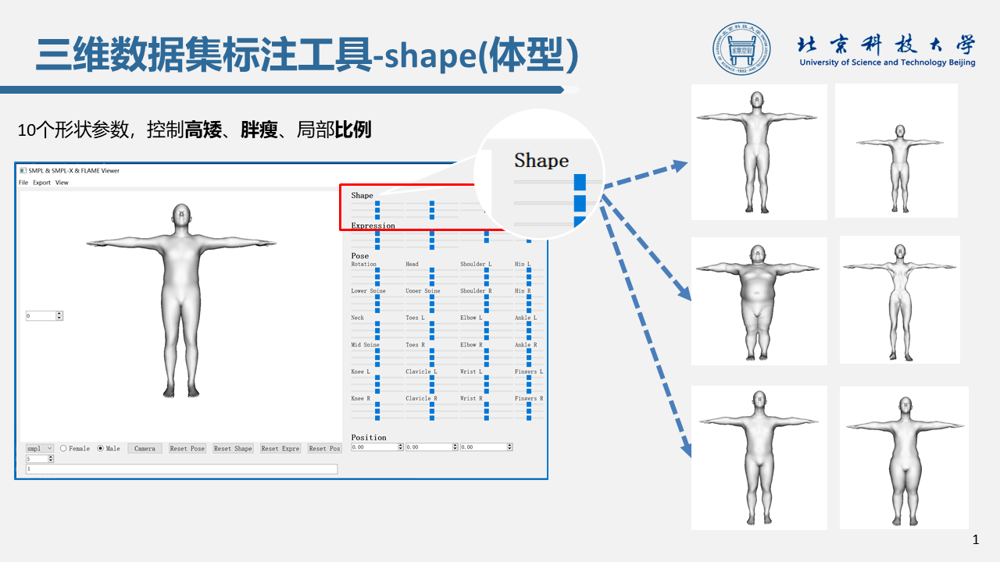
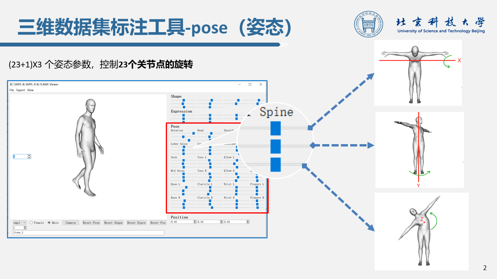
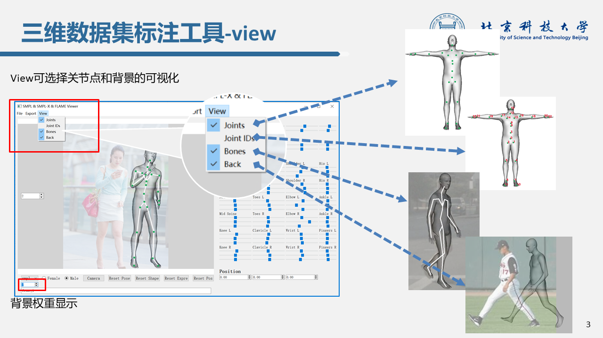
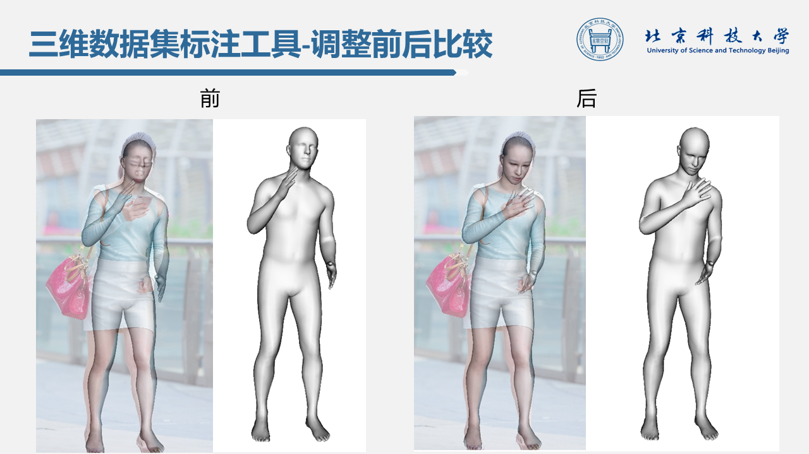

# SMPL3
# SPIN可视化标注工具

1. 环境：ubuntu16.04 + python3.6  (windows10 + python3.6)

2. 环境配置

   - 项目下载：`git clone https://github.com/wmj142326/SMPL_Tools`

   - 相关库安装：（**以下库建议后缀清华源安装**）

     ```python
     pip install numpy
     pip install scipy
     pip install chumpy
     pip install opendr==0.73 -i https://pypi.tuna.tsinghua.edu.cn/simple
     ```

   ​				   opendr安装如果失败，参考下面两种方法：
   
   ​				   方法一：参考链接：https://github.com/Lemon-XQ/human_model_viewer
   
   ​				   方法二：参考链接：https://blog.csdn.net/qq_41381865/article/details/95894077

   - 其他库的安装:

     ```python
     pip install pyqt5 <=5.12.0  # (ubuntu不要装高于5.12.0，windows随意，但不同的电脑设备好像有所区别）
     pip install opencv-python==3.4.4.19  # 这个版本最好用
     pip install pyOpenGL -i https://pypi.douban.com/simple  # 带上下载源
     pip install Bottleneck
     pip install joblib
     ```

3. 下载 SMPL，SMPL-X，FLAME(2019)到**model**文件夹下:

   - 原下载链接:
   
     smpl: https://smpl.is.tue.mpg.de/
   
     smplx: https://smpl-x.is.tue.mpg.de/
   
     flame: http://flame.is.tue.mpg.de
     
    - 百度网盘打包下载:
   
      链接：https://pan.baidu.com/s/1wE-xa1DRreZ0uwKkbuXGxA 
      
      提取码：`xoqd`

4. 运行：

   - 将.pkl文件存入`./spin/pkl_fil/`

     ```python
     python pkl2ini.python
     ```

   - 将背景图片存入`./spin/pic/`

   - 运行模型：

     ```python
     python human_model_viewer.py
     ```

5. **spin**文件夹下文件作用：

   - pkl_fil：存放SPIN生成的.pkl文件
   - ini_fil：存放.pkl提取的shape和pose等参数，作为可视化界面的导入，调整后自动保存覆盖
   - pic：存放相对应的背景图片
   - out_pic：存放导出的模型图片
   - out_mesh：存放导出的mesh文件
   - re_pkl_fil：将调整后的.pkl文件存入此文件夹
   - pkl2ini.py：将.pkl转为.ini
   - ini2pkl.py：将.ini转为.pkl
   - rest_pose.ini：基本模板（千万不要删除！！！）
   
6. windows和ubuntu使用区别：

   - windows环境配置和使用相对容易和正常
   - ubuntu的环境配置较苛刻，且使用中存在bug:
     - ubuntu在切换下一张时，自动跳两张（windows没有这个问题），如果想在ubuntu使用，建议使用手动输入的方式切换下一张（手写id)
     - 神奇的是，我换了一台ubuntu电脑，这个bug消失了！
   
7. 参考：

   原项目链接：https://github.com/Lemon-XQ/human_model_viewer

   新增功能：参数提取，添加背景，自动加载和保存、部分汉化等
   
8. GUI

   

   

   

   
