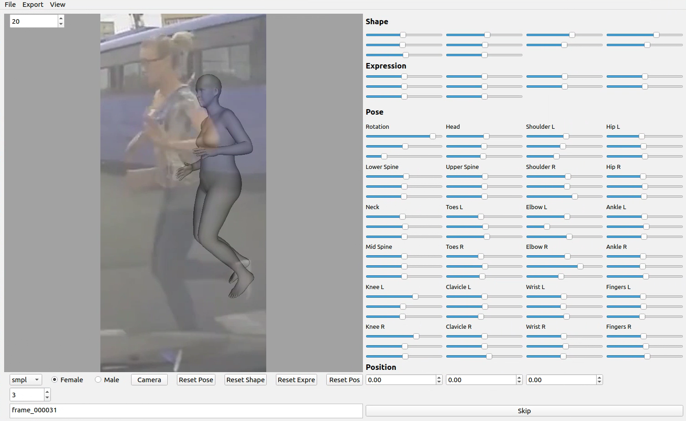
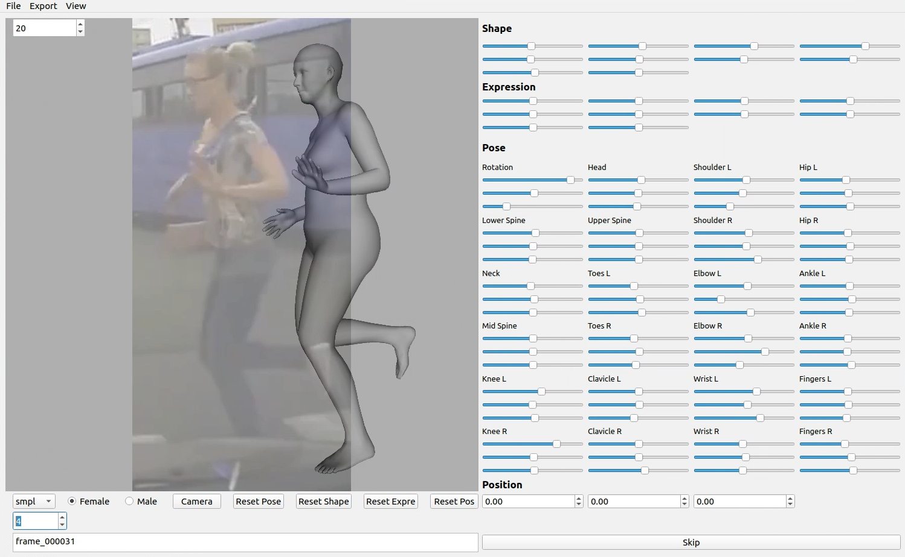

# 👣 SMPL Annotation Tools

English | [简体中文](README_CN.md)

---

1. System environment
   - ubuntu16.04 + python3.6  (windows10 + python3.6)

2. Virtual environment

   - Project Download：`git clone https://github.com/wmj142326/SMPL_Tools`

   - Related library installation：**(The following libraries are recommended to be installed with the suffix https://pypi.tuna.tsinghua.edu.cn/simple)**

     ```python
     pip install numpy
     pip install scipy
     pip install chumpy
     pip install opendr==0.73 -i https://pypi.tuna.tsinghua.edu.cn/simple
     # Other versions of opendr prompt an error about "initGL".
     ```

   ​				   If the opendr installation fails, refer to the following two methods：
   
   ​				   Method 1: Reference link：https://github.com/Lemon-XQ/human_model_viewer
   
   ​				   Method 2: Reference link：https://blog.csdn.net/qq_41381865/article/details/95894077

   - Installation of other libraries:

     ```python
     pip install pyqt5 <=5.12.0  # ubuntu do not install higher than 5.12.0, windows is free, but different computer devices seem to be different
     pip install opencv-python==3.4.4.19  # This is the most useful version
     pip install pyOpenGL -i https://pypi.douban.com/simple  # Attach download source
     pip install Bottleneck
     pip install joblib
     ```

3. Download `SMPL`，`SMPL-X`，`FLAME(2019)`to **model** folder:

   - Original download link:
   
     smpl: https://smpl.is.tue.mpg.de/
   
     smplx: https://smpl-x.is.tue.mpg.de/
   
     flame: http://flame.is.tue.mpg.de
     
    - Baidu web disk package download: [models.tar.gz](https://pan.baidu.com/s/1REDLMB3naBrEM3mcZbaZYQ?pwd=2024)

4. Run：

   - Store`.pkl`files into`./spin/pkl_fil/`
   - Store the background image into `./spin/pic/`
   - pkl to ini files:
     ```python
     python pkl2ini.py
     ```

   - Run visual annotation tool：

     ```python
     python human_model_viewer.py
     ```

5. Explain each folder under `spin` folder：

   - pkl_fil：store the `.pkl` file generated by SPIN
   - ini_fil：store the **shape** and **pose** parameters extracted from `.pkl` as the import of SMPL model, and automatically save the overlay after adjustment
   - pic：store the corresponding background images
   - out_pic：store exported SMPL model pictures
   - out_mesh：the exported SMPL mesh files are stored `(.obj)`
   - re_pkl_fil：store the adjusted `.pkl` files
   - pkl2ini.py：convert `.pkl` to `.ini`
   - ini2pkl.py：convert `.pkl` to `.ini`
   - rest_pose.ini：basic template (<span style="color:red">do not delete!!!</span>)
   
6. The difference between windows and ubuntu：

   - Windows is relatively easy and normal to configure and use
   - Ubuntu's environment configuration is harsh, and there are bugs in use:
     - ubuntu automatically jumps two when switching to the next one (windows does not have this problem), if you want to use in ubuntu, it is recommended to use manual input to switch to the next one (handwritten id)
     - Miraculously, I switched to an ubuntu computer and the bug disappeared!
     - Update: Old version of pyqt5 will cause this bug, change to the latest version is good.
   
7. Reference：

   Original project link：[human_model_viewer](https://github.com/Lemon-XQ/human_model_viewer).

   Added functions: parameter extraction, adding background, automatic loading and saving, partial Chinese, etc
   
8. GUI

<table>
  <tr>
    <td>ann_before</td>
    <td>ann_after</td>
  </tr>
  <tr>
    <td></td>
    <td></td>
  </tr>
</table>

9. Video

- A detailed annotation process can be downloaded or viewed [here](https://github.com/wmj142326/SMPL_Annotation_Tools/blob/main/README.assets/smpl_tools_tutor.mp4).

### Citation
   ```
@inproceedings{
wang2024pedestriancentric,
title={Pedestrian-Centric 3D Pre-collision Pose and Shape Estimation from Dashcam Perspective},
author={MeiJun Wang and Yu Meng and Zhongwei Qiu and Chao Zheng and Yan Xu and Pengxiaorui and Jian Gao},
booktitle={The Thirty-eighth Annual Conference on Neural Information Processing Systems},
year={2024},
url={https://openreview.net/forum?id=ldvfaYzG35}
}
   ```